# DSMC Particle Simulator


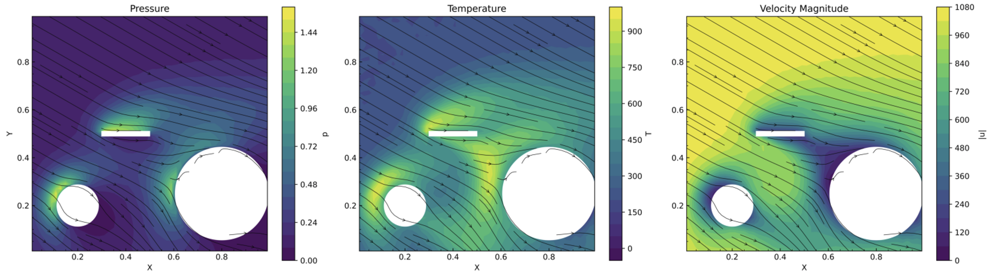


This project is a 3D CUDA-accelerated implementation of Direct Simulation Monte Carlo (DSMC), which is a stochastic solution of the Boltzmann equation for rarefied gases. These gases are common in supersonic and hypersonic flows with a Knudsen number $\text{Kn}\gt 1$, where Navier Stokes equations have proven to be inaccurate because the continuum assumption fails. For example, it is used in aerodynamics to model Space Shuttle re-entry into the atmosphere.

## Description

It works by simulating particles (which correspond to a large number of real particles derived via the statistical weight parameter $W=\frac{\delta x^2 \delta z n_\infty}{N_{C0}}$ determined by the desired number of simulated particles) which are in a mesh-free domain and undergoing an initial flow velocity. Then we group them in cells that are approximately smaller than the mean free path of the molecules, which is a crucial property of rarefied gases that DSMC exploits. Within each cell we probabilistically collide particle pairs based on a probability derived from the kinetic theory of gases. After enough steps have passed for a flow pattern to emerge, we begin with statistical sampling (Monte Carlo method) to ultimately find the average pressure, temperature, and velocity magnitude across the domain.

Our CUDA implementation uses novel techniques in order to boost performance (including what we believe is the first CUDA implementation of the Half-Split-Shuffle algorithm published last year). Despite the control-heavy algorithm of DSMC with stochastic collisions making coalesced accesses particularly difficult, we are happy to share up to a **298x speedup on a single V100 GPU** compared to a mid-range AMD Ryzen 5000 CPU running the equivalent serial version. 
<p align="center">
  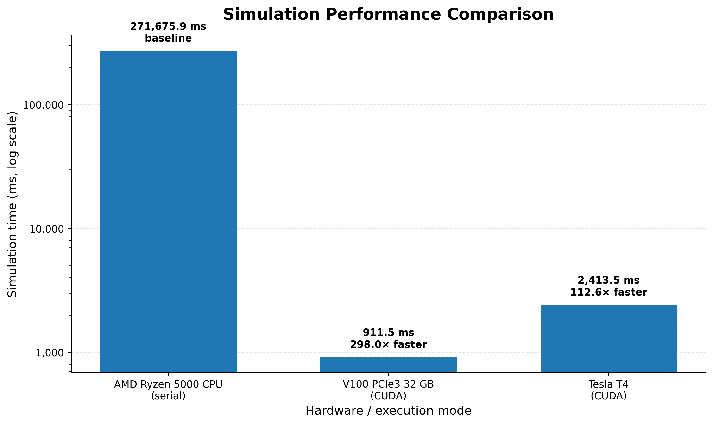
</p>

## Handling Collisions

For collisions, we use two approaches. The "No Time Collision Scheme" by Bird is common in DSMC, but suffers from a lack of intra-cell parallelism by design. Within each cell, collisions must be serialized because of possible repeated particles being selected to collide in sequence. Removing the possible same-particle collisions gives up the stochastic principles that make NTC work. As collisions were the major bottleneck of the entire DSMC program, our solution to this was as follows:
1. Sort all cells into a work queue, determine the cut-off of where heavy cells ($\ge 300$ particles) end and light cells ($\lt 300$ particles) begin.
2. Launch one thread per cell for the light cells using NTC scheme

*Note: All illustrations in this README are drawn ourselves*
<p align="center">
  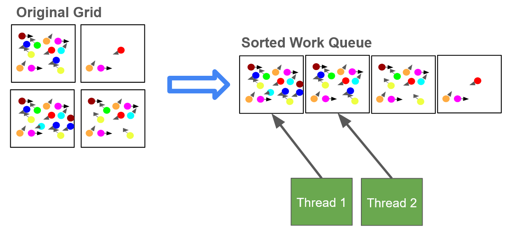
</p>
3. For heavy cells, use the Half Split Shuffle algorithm proposed by Bhattarai et al. just a few months ago, which is a parallel DSMC collision method for FPGAs. We made the first CUDA implementation of this novel method for heavy cells, which gave us **up to $21.2\%$ speedup** on overall execution time (depending on particles number). 
<p align="center">
  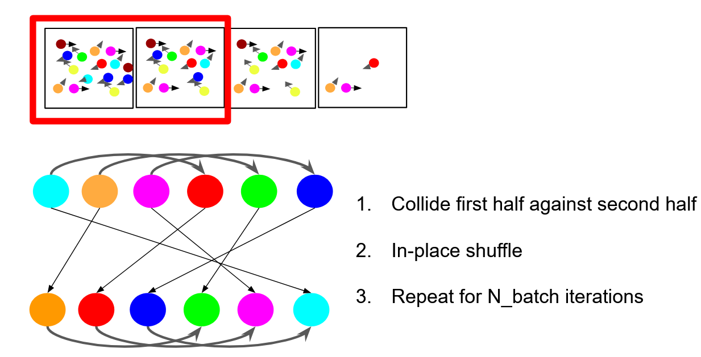
</p>

Our initial 2D serial version adapted from DSMC lectures found online of [University of Alabama](https://volkov.eng.ua.edu/ME591_491_NEGD/2017-Spring-NEGD-06-DSMC.pdf) and [Purdue University](www.youtube.com/watch?v=cSFr8MTr30Y).

## CUDA Development Process

We made several CUDA improvements over the course of this project, following the recommended methodology by NVIDIA with NSight Systems and NSight Compute. They are summarized in the list below, grouped by milestones which are graphed to visualize the acceleration speedups (over 2000 time steps). Trackable in the closed PRs with speedup documented per change, we made the following main improvements:
1. Naive CUDA implementation **<-- Milestone (Blue)**
2. Improved private, shared, and constant memory
3. Add slurm deployment for Galileo 100 cluster
4. AoS to SoA
5. Implement Half-Split-Shuffle Algorithm to parallelize collisions of heavy cells
6. Reduce fp64 pressure **<-- Milestone (Orange)**
7. Particle reordering
8. Sorted, ordered particles
9. Hybrid AoS/SoA memory layout
10. Work Queues for faster collisions
11. Adding MPI support for multiple GPUs **<-- Milestone (Green)**

<p align="center">
  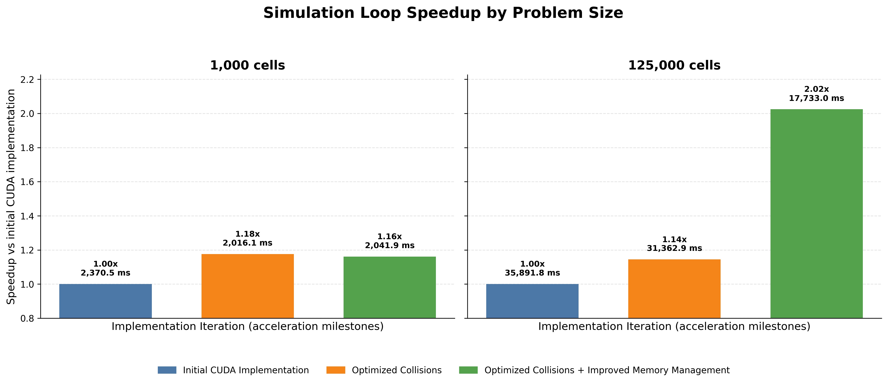
</p>
Specifically, the following kernels were bottlenecks that drove our optimizations:

<p align="center">
  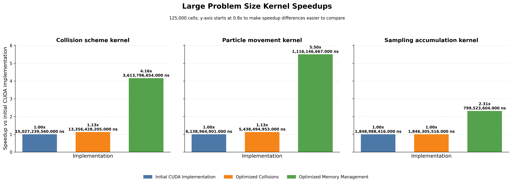
</p>

While DSMC has been shown to work well with around 50 similated particles per cell in published literature, we wanted to ensure we can scale to more detailed simulations for more complex flows. The follow graph demonstrates the scaling speedup as the number of particles grow (where total number of particles is particles per cell $\times 125000$ cells), for example for 300 target particles per cell, that is $300 \times 125000 = 37,500,000$ simulated particles. We can see how powerful HSS is in the scale up from 100 to 200 particles per cell; we solve **double** the program size in only **~21%** extra time.
<p align="center">
  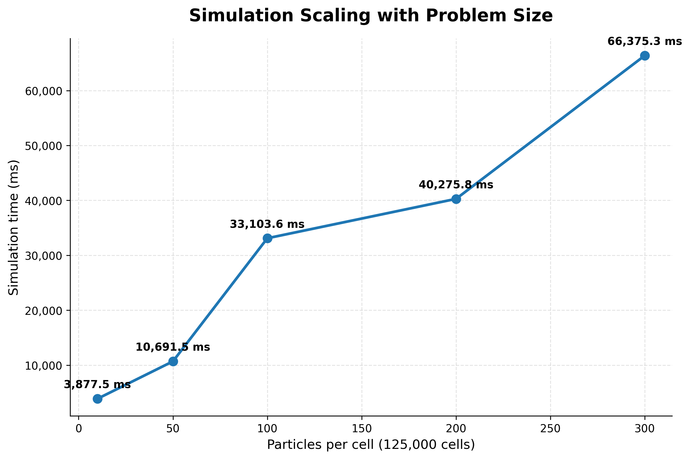
</p>

## Memory Coalescing
The stochastic nature of DSMC meant that we are largely memory-bound. With NSight compute we experimented to determine the best memory layout and memory arrangement scheme to maximize coalesced access. We began with a SoA setup, as follows:
<p align="center">
  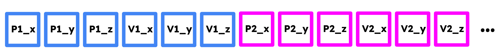
</p>

For improved memory coalescing when many threads within a warp access particle data, we initially switched to an AoS layout as seen below: 

<p align="center">
  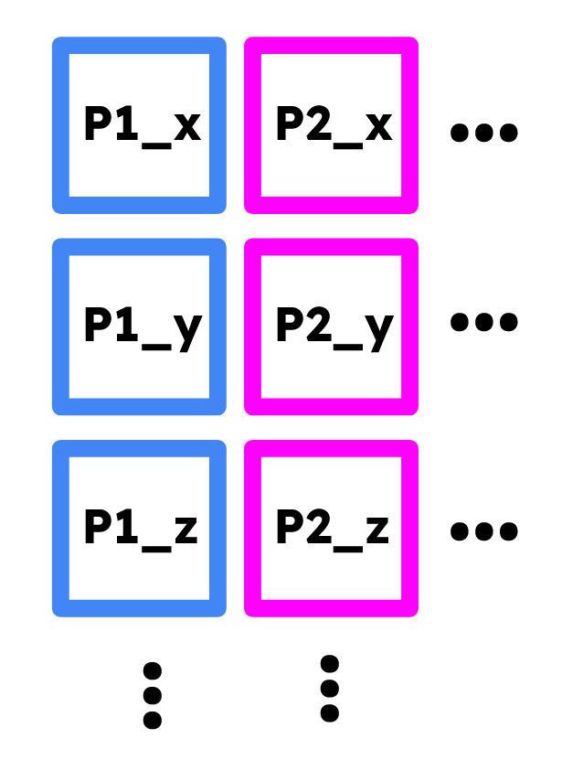
</p>

While overall accesses became more coalesced, collision kernels got penalized, and had even more uncoalesced access now. We realized that this is because particles tended to not be near each other, as their memory location did not change since their initialization, but particles move across different cells. With this information from NSight Compute, we then experimented with a periodic reorder kernel; every $N$ time steps, we reorder all particle data stored in shared memory according to which cell they are in. We do not have to do this every cell since particles generally move similarly to their neighbours, so we found that optimally we reorder particle memory locations every $20$ iterations. 

<p align="center">
  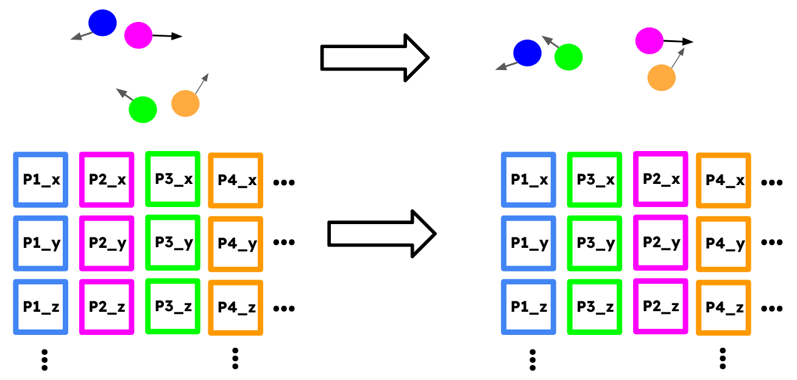
</p>

| Row | Baseline time (ms) | Reorder every 20 iters time (ms) | Speedup vs baseline | Reorder every iter time (ms) | Speedup vs baseline |
|---|---:|---:|---:|---:|---:|
| Entire program | 33355.3465 | 31954.7338 | **4.20%** | 39127.0298 | -17.30% |
| NTC Kernel | 13367.3636 | 13028.0362 | 2.54% | 10401.1746 | **22.19%** |
| Binning Kernel | 4820.8184 | 2178.6170 | 54.81% | 1580.4815 | 67.22% |
| HSS Kernel | 525.7128 | 455.7363 | 13.31% | 403.8196 | 23.19% |

However, we noticed that many kernels still struggled with uncoalesced accesses, particularly binning and filtering. So we largely changed the simulation workflow to keep an ordered particle memory array that is re-sorted every iteration and uses the CUDA CUB library for prefix sum calculations.

|   |   Baseline | Ordered   |   Speedup |
|---|---|---|---|
| Simulation loop  |  85137.6991 ms   | 78016.3177 ms  | ~**9,1%** |
| NTC Kernel |  31,719,701,209 ns   | 22,325,947,517 ns  | ~**42,1%** |
| Accumulate Sampling Kernel |  4,094,276,972 ns   | 2,756,624,005 ns  | ~**48,5%** |

Finally, we noticed memory coalescing was still a problem even with this new arrangement. We decided to try a hybrid SoA/AoS approach where particle position data is stored contiguously per particle, but separately from velocity. This memory layout was able to speedup certain kernels like NTC by $110\%$ compared to the original layout, and overall simulation time by up to $16.9\%$.

<p align="center">
  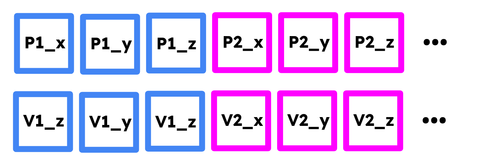
</p>

At first we thought that having padding would improve coalescing because of memory banking (so having 16-byte contiguous particle data), but this proved to just inflate memory time at no benefit, probably because CUDA memory banks seem to be 4 bytes so one float, whereas the padding increases it to 16 bytes (4 entries * 4 floats) that each warp accesses, but this is too large actually benefit. Below are key kernel results:

| Metric | Baseline | Pack with padding | Pack without padding |
|---|---:|---:|---:|
| **All program elapsed time** | 28408.7264 ms | 26312.3658 ms (+7.97%) | 24429.8763 ms **(+16.29%)** |
| CUDA API: cudaMemcpy total time | 26892.9608 ms | 24808.7988 ms (+8.40%) | 22900.8423 ms (+17.43%) |
| Kernel: no_time_counter_scheme total time | 7999.3111 ms | 3826.5423 ms **(+109.05%)** | 3791.9530 ms **(+110.95%)** |
| Kernel: scatter_and_key total time | 2674.6308 ms | 3847.1743 ms (-30.48%) | 3211.3467 ms (-16.71%) |
| Kernel: accumulate_sampling total time | 1253.8859 ms | 741.5385 ms **(+69.09%)** | 806.2923 ms (+55.51%) |


## Building and running
First, install dependencies. We use NVCC and MPI, alongside the build tools like cmake.
```
sudo apt update
sudo apt install -y build-essential cmake nvidia-cuda-toolkit openmpi-bin libopenmpi-dev
```

To build the CUDA version:
```
cd cuda # or serial for serial version
mkdir build
cd build
cmake .. -DCMAKE_CUDA_ARCHITECTURES=70 # or higher, defaults to "native"

make
```

To run on a cluster, you can use the predefined slurm jobs. 
```
# Run on a single GPU without MPI
sbatch single-gpu-slurm.sh

# Run over multiple GPUs using MPI
sbatch multi-gpu-slurm.sh
```

To run locally, you have three options. 
```
# horizontal flow against a sphere case
./DSMC_single_gpu sphere

# angled supersonic flow against an infinitely thin wing 
./DSMC_single_gpu wing

# complex sphere-wing multiple obstacle setup
./DSMC_single_gpu combo
```

With `plot.py` the plot can be generated for a slice of the 3D space. For example, we can plot the z=0.55 hyperplane on the sphere case using:
```
python plot.py sphere build/fields_avg.dat z_val=0.55 output_plot.png
```

When running without MPI, the `.vpi` and `.vpt` files are created that can be opened with ParaView. This industry standard tool allows for full flexibility with dealing with the data produced by the DSMC simulation. 

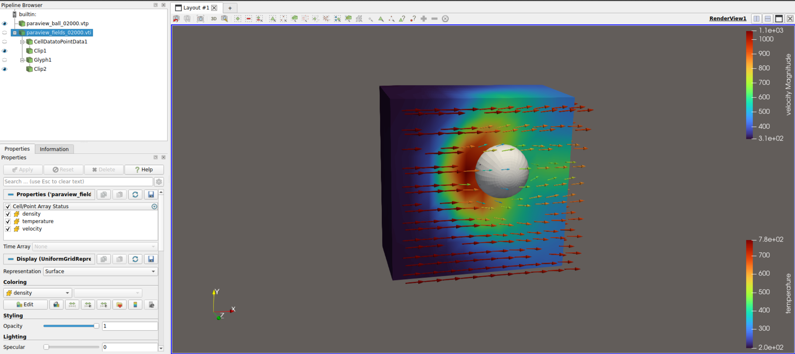
