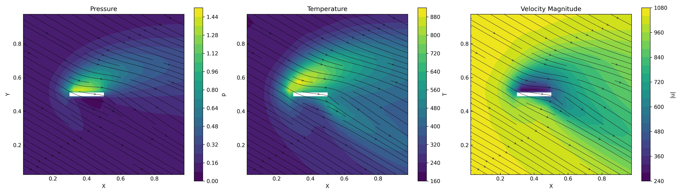

# DSMC Particle Simulator



Basic version being adapted from these course notes from University of Alabama:
https://volkov.eng.ua.edu/ME591_491_NEGD/2017-Spring-NEGD-06-DSMC.pdf

and this lecture recording from Purdue University:
www.youtube.com/watch?v=cSFr8MTr30Y

## Building and running

To build:
```
mkdir build # if build directory does not exist
cd build
cmake ..
make
./DSMC  # executes simulation
```

With `plot.py` the plot can be generated:
```
./plot.py build/fields_avg.dat output_plot.png
```

When running `./DSMC`, the `.vpi` and `.vpt` files are created that can be opened with ParaView.